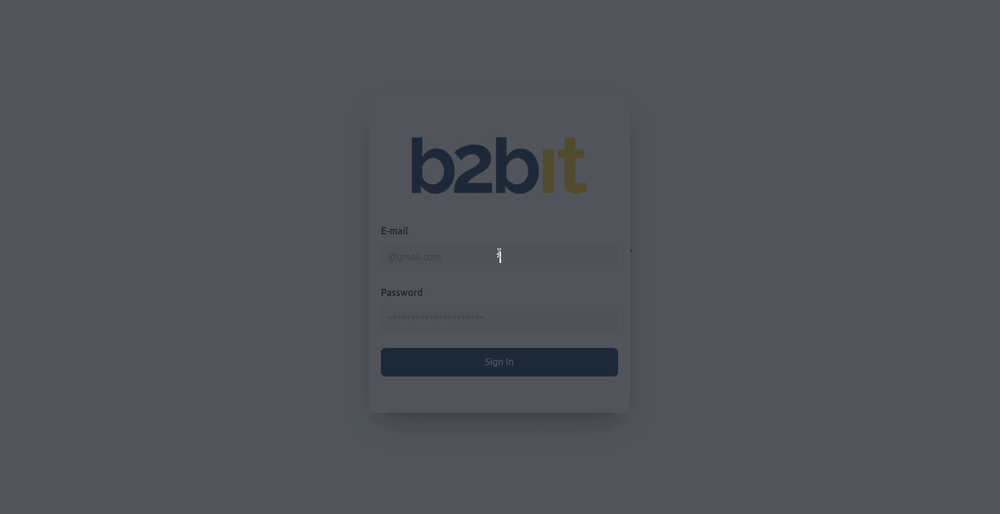

<h1 align='center'>
  
</h1>



## 📚 About
This is a sample project for the b2bit company.

The b2bit consists of a simple login page and a profile page, with the user data displayed on the profile page.

## 🔨 Tools
- [React Js](https://react.dev/)
- [Typescript](https://www.typescriptlang.org/)
- [Tailwind css](https://tailwindcss.com/)
- [Cypress](https://www.cypress.io/)

## ✍️ How to contribute

```bash
  # Clone the repository
  https://github.com/RafaelFernandes12/b2bit.git
```
```bash
  # Enter the repositoy
  cd b2bit
```
```bash
  # Install all the dependencies
  npm install
```

